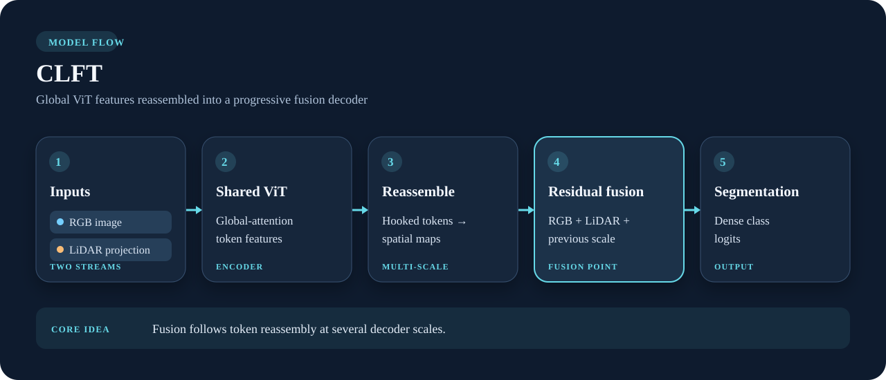

# CLFT

**Global ViT features, fused while decoding.** CLFT runs the camera image and a projected LiDAR image through the same vision transformer. Features captured from several transformer blocks become spatial maps; residual fusion combines the two modalities from coarse to fine.

{ .model-diagram }

*The highlighted card marks where the two streams meet. The diagram describes fusion mode; RGB-only and LiDAR-only modes use one stream.*

## Why choose it

CLFT uses global ViT attention and reassembles token features at several resolutions. It is the reference for comparing the hierarchical Swin design in [CLFTv2](CLFTv2.md). The library returns dense class logits; the underlying implementation can also produce a depth head, but the public `CLFT` wrapper exposes segmentation.

```python
from visin_fusion.models import CLFT

model = CLFT(num_classes=4, image_size=384, mode="cross_fusion")
logits = model(rgb, lidar)  # [batch, 4, height, width]
```

`rgb` and `lidar` are image tensors; `lidar` is a **projected image**, not a raw point cloud. Set `mode="rgb"` or `mode="lidar"` for a single stream. See the [library API](../library.md) for the common input and checkpoint contract.

## Research references

- Gu, Bellone, Pivoňka & Sell, [*CLFT: Camera-LiDAR Fusion Transformer for Semantic Segmentation in Autonomous Driving*](https://arxiv.org/abs/2404.17793), 2024. The camera–LiDAR fusion model behind this implementation.
- Tahves, Gu, Bellone & Sell, [*A Novel Vision Transformer for Camera-LiDAR Fusion based Traffic Object Segmentation*](https://arxiv.org/abs/2501.02858), 2025. Extends CLFT traffic-object segmentation to more classes and evaluates it across varied weather conditions.
- Ranftl, Bochkovskiy & Koltun, [*Vision Transformers for Dense Prediction*](https://arxiv.org/abs/2103.13413), 2021. Background for reassembling ViT tokens into multi-scale dense features.
