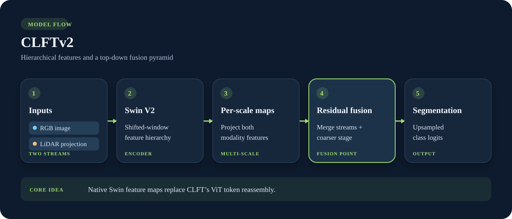

# CLFTv2

**Hierarchical features, fused through a top-down pyramid.** CLFTv2 uses a shared Swin V2 backbone to encode RGB and projected LiDAR separately. At each scale it projects and combines their feature maps with the previous, coarser fusion stage.

{ .model-diagram }

*The highlighted card marks per-scale fusion. The backbone already returns spatial feature maps, so this path has no ViT token reassembly step.*

## Why choose it

Compared with [CLFT](CLFT.md), the main change is the hierarchical shifted-window backbone and its native multi-scale maps. The default library strategy is `residual_average`; the underlying fusion module also implements other strategies for experiments. The public class returns dense class logits.

```python
from visin_fusion.models import CLFTv2

model = CLFTv2(num_classes=4, mode="cross_fusion", fusion_strategy="residual_average")
logits = model(rgb, lidar)
```

Use `mode="rgb"` or `mode="lidar"` to isolate one stream. See the [library API](../library.md) for tensor shapes and training setup.

## Research references

- Tahves, Bellone & Sell, [*CLFTv2: Efficient Camera-LiDAR Fusion for Semantic Segmentation via Hierarchical Feature Pyramids*](https://arxiv.org/abs/2609.09881), 2026. The CLFTv2 research architecture.
- Liu et al., [*Swin Transformer V2: Scaling Up Capacity and Resolution*](https://arxiv.org/abs/2111.09883), 2021. The backbone family used by the default library model.
