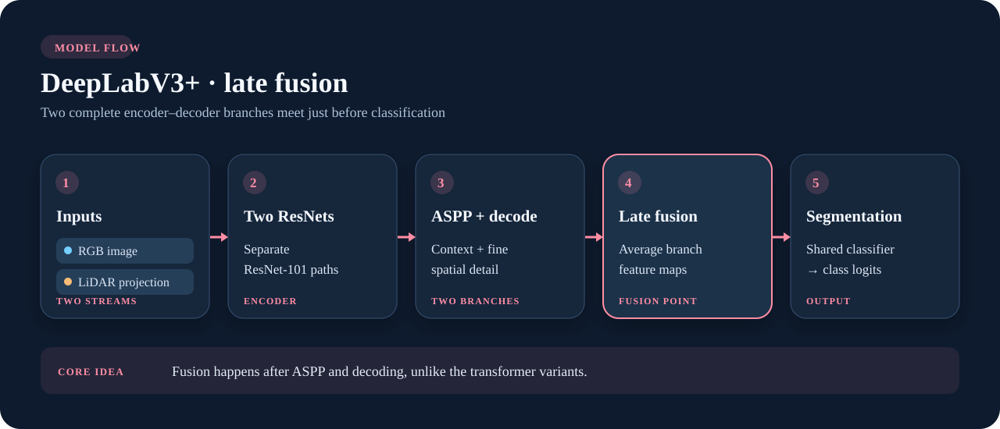

# DeepLabV3+

**Convolutional encoder–decoder with late sensor fusion.** The RGB and projected LiDAR branches each run a ResNet-101 encoder, atrous spatial pyramid pooling (ASPP), and a decoder. In fusion mode, their decoded features are averaged before one shared classifier predicts semantic logits.

{ .model-diagram }

*The highlighted card marks late fusion. RGB-only and LiDAR-only modes use one DeepLabV3+ branch.*

## Why choose it

DeepLabV3+ provides a convolutional comparison to the transformer families. ASPP captures context at multiple dilation rates while the decoder adds lower-level spatial detail. **Late camera–LiDAR fusion is this repository's extension** of the original image segmentation architecture.

```python
from visin_fusion.models import DeepLabV3Plus

model = DeepLabV3Plus(num_classes=4, mode="fusion", fusion_strategy="residual_average")
logits = model(rgb, lidar)
```

This class uses `mode="fusion"` for both streams; its single-stream modes are `"rgb"` and `"lidar"`. See the [library API](../library.md) for the shared output contract.

## Research references

- Chen, Zhu, Papandreou, Schroff & Adam, [*Encoder-Decoder with Atrous Separable Convolution for Semantic Image Segmentation*](https://arxiv.org/abs/1802.02611), 2018. Introduces DeepLabV3+; the two-stream late-fusion path here is a library adaptation.
