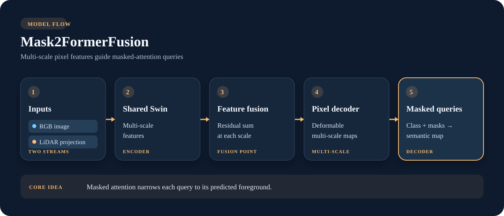

# Mask2FormerFusion

**Multi-scale masked attention for each query.** Like MaskFormerFusion, this model fuses RGB and projected LiDAR features after a shared backbone. Its pixel decoder mixes information across scales with deformable attention; each query then attends primarily inside its predicted mask region.

{ .model-diagram }

*The highlighted masked-query stage is the main architectural change from MaskFormer. This library implements the decoder in PyTorch and returns semantic segmentation.*

## Why choose it

Mask2Former extends mask classification with masked attention and multi-scale pixel features. Here, the camera–LiDAR two-stream feature fusion is a library adaptation; the original paper addresses image segmentation rather than this sensor pair. The public model returns dense semantic logits assembled from query class and mask predictions.

```python
from visin_fusion.models import Mask2FormerFusion

model = Mask2FormerFusion(num_classes=4, mode="cross_fusion", num_queries=100)
logits = model(rgb, lidar)
```

For a custom training loop, use the raw query outputs with `training_setup().loss`; see [Training from Python](../library.md#training-from-python).

## Research references

- Cheng et al., [*Masked-attention Mask Transformer for Universal Image Segmentation*](https://arxiv.org/abs/2112.01527), 2021. Introduces Mask2Former and masked-attention queries.
- Liu et al., [*Swin Transformer V2: Scaling Up Capacity and Resolution*](https://arxiv.org/abs/2111.09883), 2021. The default backbone family in this library.
