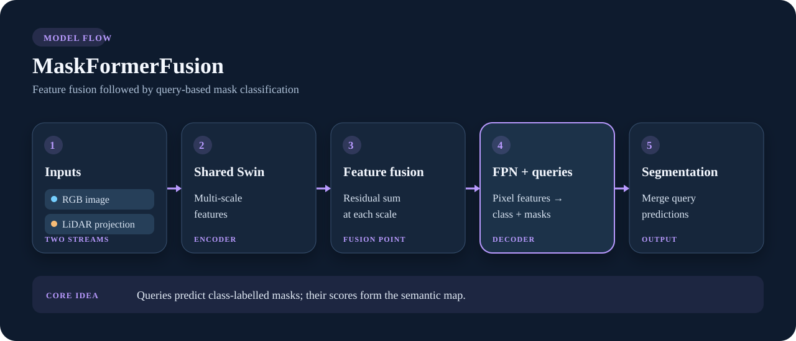

# MaskFormerFusion

**Fuse multi-scale features, then classify masks.** A shared backbone encodes RGB and projected LiDAR independently. Their corresponding feature maps are combined before a lightweight FPN pixel decoder. Learned queries predict a class and a mask; the query outputs are merged into semantic logits.

{ .model-diagram }

*Fusion is after feature extraction and before the pixel decoder. The query decoder is the main difference from CLFT and CLFTv2's direct dense heads.*

## Why choose it

MaskFormer frames segmentation as **mask classification** rather than direct per-pixel classification. This implementation adds camera–LiDAR feature fusion and uses a plain FPN pixel decoder in place of the transformer encoder used in some original MaskFormer configurations. It produces semantic segmentation only.

```python
from visin_fusion.models import MaskFormerFusion

model = MaskFormerFusion(num_classes=4, mode="cross_fusion", num_queries=100)
logits = model(rgb, lidar)
```

For a custom training loop, the query loss needs `model.raw_forward(...)`; see [Training from Python](../library.md#training-from-python).

## Research references

- Cheng, Schwing & Kirillov, [*Per-Pixel Classification is Not All You Need for Semantic Segmentation*](https://arxiv.org/abs/2107.06278), 2021. Introduces MaskFormer's mask-classification formulation.
- Liu et al., [*Swin Transformer V2: Scaling Up Capacity and Resolution*](https://arxiv.org/abs/2111.09883), 2021. The default backbone family in this library.
