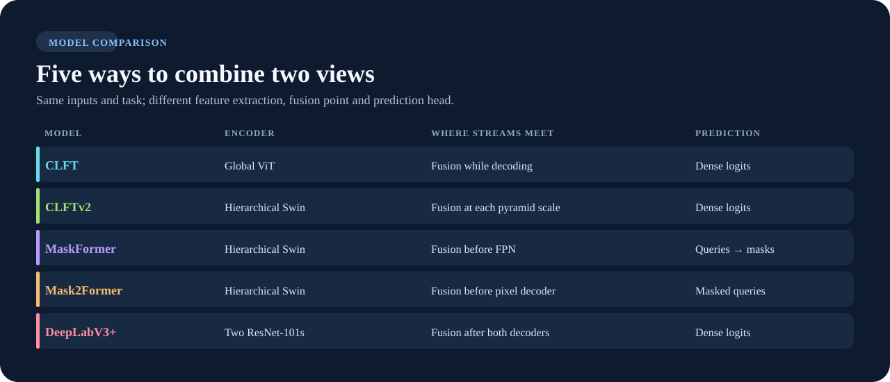

# Visin Fusion

A Python library for comparing camera and projected LiDAR semantic segmentation models. Import a model into your own code, or use the optional pipeline to train, evaluate, visualize and benchmark it from a config.

```python
from visin_fusion.models import CLFTv2

model = CLFTv2(num_classes=4, mode="cross_fusion")
logits = model(rgb, lidar)  # [batch, classes, height, width]
```

Five research model families share this calling convention. Their fusion points and prediction heads differ:

{ .model-diagram }

- [Use as a library](library.md): installation, model API, inference, training and checkpoints.
- [Compare models](models.md): diagrams, implementation differences and paper references.
- [Getting started](getting-started.md): a quick library example and the sample pipeline.
- [Download and train](download-and-train.md): ZOD, Waymo, and Iseauto examples for all four CLI stages.
- [Training examples](training-examples.md): choose among five models and RGB, LiDAR, or fusion.
- [Configs](configs.md) and [Datasets](datasets.md): run the pipeline on your own data.

The `train` extra enables the full pipeline. Visin reporting and `visin:` datasets use the separate `visin` extra. Neither is needed to import a model.
